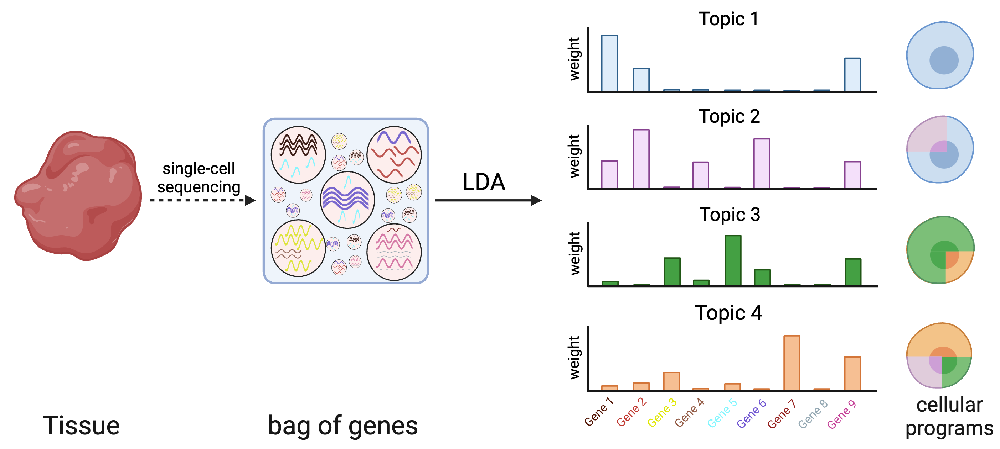
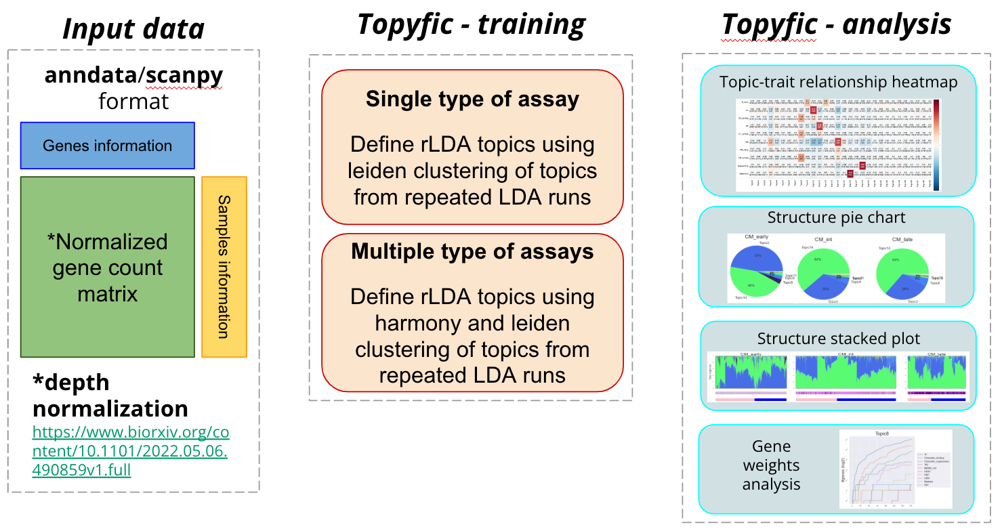

# Topyfic

## Topyfic: Reproducible latent dirichlet allocation (LDA) using leiden clustering and harmony for single cell epigenomics data

An open challenge for the analysis of single-cell data is the identification of distinct cellular programs that may be simultaneously expressed in the same cell based on the interaction of genotypes in environments. Latent Dirichlet allocation (LDA) is a popular statistical method for the identification of recurring patterns in count data (e.g. gene expression), which are referred to as topics. These topics are composed of genes with specific weights that can together explain underlying patterns of gene expression profile for each individual cell. In particular, each cell’s expression profile can be decomposed into a combination of the topics that can be analyzed both globally using topic-trait enrichment as well as in individual cells using structure plots. Due to the random initialization of LDA algorithms, topic definitions can vary substantially each time that the algorithm is rerun, which hinders their interpretability. Therefore, we developed reproducible LDA where we define our topics by analysing their reproducibility across a large number of runs.

Topyfic is a Python library designed to apply rLDA to single_cells/bulk RNA-seq data to recover meaningful topics that involve the key genes like transcription factors involved in different steps.

## Documentation
Topyfic's full documentation can be found at [here](https://mortazavilab.github.io/Topyfic/html/index.html)

## Installation

To install Topyfic, python version 3.8 or greater is required.

### Install from PyPi (recommended)
Install the most recent release, run

`pip install Topyfic`

### Install with the most recent commits
git cloning the [Topyfic repository](https://github.com/mortazavilab/Topyfic), going to the Topyfic directory, run

`pip install .`

## Tutorials

In general, you need to make three objects (Train, TopModel and Analysis). 

The Train object can be initialized either from (a) single cell RNA-seq dataset or (b) single cell ATAC-seq or (c) bulk RNA-seq.

Training part can be time-consuming depending on how big your data is, however you can learn each train model per random state in different jobs and then combine all together. Look at [this tutorial](tutorials/make_train_object.ipynb) for mor information.

For guidance on using Topyfic to analyze your data look at our more depth-in tutorials:

- [Analysing single cell C2C12 data only using regulatory elements](tutorials/C2C12_TFs_mirhgs_chromreg/C2C12.ipynb): Analysing single cell and single nucleus using C2C12 ENCODE datasets using regulatory elements instead of all genes.
- [Analysing single cell microglia data](tutorials/microglia_all_genes/microglia.ipynb): Analysing single cell microglia data from [Model-AD portal](https://www.model-ad.org/).

If you are using other methods to learn your topics but you are still interested in doing downstream analysis, you can embeded your results in the format describe [here](tutorials/topic_modeling_model.md). Once you have all your files read you can embed them in suitable format using [this notebook]().

## Cite

comming soon ...
