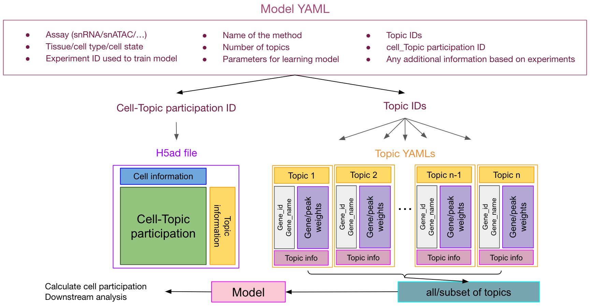

# Topic modeling data model

To be able to present data and topics in the human-readable way, I develop this data model.

One of the main advantage of that is you can embed your results in this format and will be able to use all the downstream analysis even though you used different software to find your topics!

You have to save three type of objects
1. Model YAML file: Capture all the information about the dataset that you used and which method and how you run it along with Topic_ID which points to Topic YAML files and Cell-Topic participation ID for pointing out the Cell-Topic participation h5ad file.
2. Topics YAML files: Capture all the information about Topics including Topic_ID, gene_weight, gene_id and gene_name and any other information that suits your data
3. Cell-Topic participation h5ad file




## Model YAML
```yaml
Assay: single nucleus RNA-seq
Cell-Topic participation ID: IGVF_000001_23
Experiment ID: IGVF_000001
Name of method: Topyfic
Number of topics: 22
Technology:
- Parse
- 10x
Topic IDs:
- IGVF_000001_Topic_1
- IGVF_000001_Topic_2
- IGVF_000001_Topic_3
- IGVF_000001_Topic_4
- IGVF_000001_Topic_5
- IGVF_000001_Topic_6
- IGVF_000001_Topic_7
- IGVF_000001_Topic_8
- IGVF_000001_Topic_9
- IGVF_000001_Topic_10
- IGVF_000001_Topic_11
- IGVF_000001_Topic_12
- IGVF_000001_Topic_13
- IGVF_000001_Topic_14
- IGVF_000001_Topic_15
- IGVF_000001_Topic_16
- IGVF_000001_Topic_17
- IGVF_000001_Topic_18
- IGVF_000001_Topic_19
- IGVF_000001_Topic_20
- IGVF_000001_Topic_21
- IGVF_000001_Topic_22
level: tissue
```

## Topic YAML

```yaml
Gene information:
  gene_biotype:
    Actl6a: Chromatin_binding
    Actl6b: Chromatin_binding
    Actn4: Chromatin_binding
    Actr6: Chromatin_binding
    Actrt1: Chromatin_binding
    Adnp: Chromatin_binding
    Aire: Chromatin_binding
    Ajuba: Chromatin_binding
    Akap8: Chromatin_binding
    Ankrd2: Chromatin_binding
  gene_id:
    Actl6a: ENSG00000136518
    Actl6b: ENSG00000077080
    Actn4: ENSG00000130402
    Actr6: ENSG00000075089
    Actrt1: ENSG00000123165
    Adnp: ENSG00000101126
    Aire: ENSG00000160224
    Ajuba: ENSG00000129474
    Akap8: ENSG00000105127
    Ankrd2: ENSG00000165887
Gene weights:
  Actl6a: 852.4478344747525
  Actl6b: 0.045454545454545456
  Actn4: 1423.5839163462322
  Actr6: 739.7730004645322
  Actrt1: 0.045454545454545456
  Adnp: 816.1664489507675
  Aire: 0.045454545454545456
  Ajuba: 0.045454545454545456
  Akap8: 1676.8289759159088
  Ankrd2: 0.045454545454545456
Topic ID: IGVF_000001_Topic_1
Topic information:
  variance: 512971.1430917481
```

## Write Topyfic results in this format

you can use `write_model_yaml()` and `write_topic_yaml()` functions to embedded your results in this format.

```python 
import Topyfic

# Read analysis object
analysis = Topyfic.read_analysis("analysis.p")

# information about model and datasets
model_info = {
    'Experiment ID': 'IGVF_000001',
    'Assay': 'single nucleus RNA-seq',
    'Technology': ['Parse', '10x'],
    'level': 'tissue',
    'Name of method': 'Topyfic',
    'Number of topics': 22,
}


write_model_yaml(model_info, analysis.cell_participation)

for topic in analysis.top_model.topics:
    print(topic)
    write_topic_yaml(topic_id=f"IGVF_000001_{topic}",
                     topic_info=analysis.top_model.topics[topic], 
                     model_yaml_path="model.yaml", 
                     topic_yaml_path=f"{topic}.yaml", 
                     save=True)
```

## Read results and embed them in Topyfic data model

```python 
import Topyfic

topic_yaml_path = 'topic_files/'
model_yaml_path = 'topic_files/model.yaml'
cell_topic_participation_path = "topic_files/cell_topic_participation.h5ad"

topModel, analysis = Topyfic.read_model_yaml(model_yaml_path=model_yaml_path,
                    topic_yaml_path=topic_yaml_path,
                    cell_topic_participation_path=cell_topic_participation_path,
                    save=True)

```


